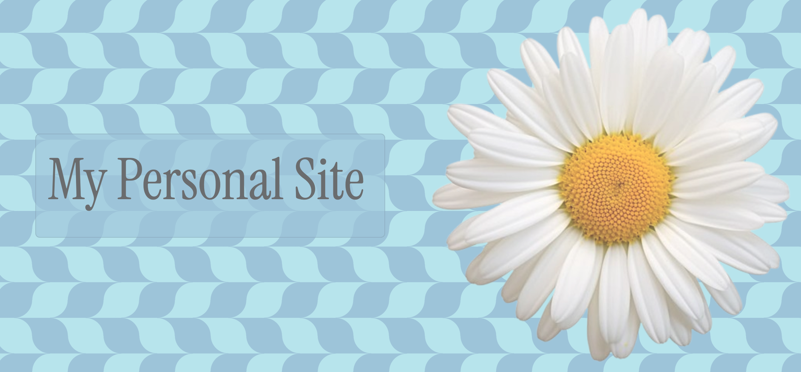

# Welcome to my Site!

The purpose of this website is to showcase my hobbies and projects im working on. 

## What I used:
I used bootstrap to style the opening banner, and I used cards for the other sections and made them slightly transparent.
For the Hobbies section, I used flexbox to align all the images. Lastly, to make the website responsive for smaller screens I used media queries to make the layout adaptive. I have only learned HTML and CSS as of now so there's no interactive features T-T. 

## What I included:
I have a lot of hobbies and I'm often working on several projects at once, so i decided to make an entire section for my hobbies. As I make more artwork, and discovering better books I'll add them to the site too! 

## Link to my website:
Live Link: <a href="https://909aminoacid909.github.io/Personal-site/">https://909aminoacid909.github.io/Personal-site/<a>

